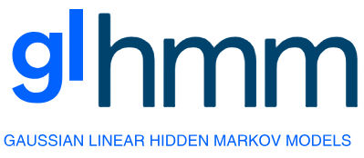

[](https://glhmm.readthedocs.io/en/latest/?badge=latest)

The GLHMM toolbox provides facilities to fit a variety of Hidden Markov models (HMM) based on the Gaussian distribution, which we generalise as the Gaussian-Linear HMM. 
Crucially, the toolbox has a focus on finding associations at various levels between brain data (EEG, MEG, fMRI, ECoG, etc) and non-brain data, such as behavioural or physiological variables.

## Important links

- Official source code repo: <https://github.com/vidaurre/glhmm>
- GLHMM documentation: <https://glhmm.readthedocs.io/en/latest/index.html>

## Dependencies

The required dependencies to use glhmm are:

- Python >= 3.6
- NumPy
- numba
- scikit-learn
- scipy
- matplotlib
- seaborn

- cupy (only when using GPU acceleration; requires manual install)

## Installation

- To install the latest development version from the repository, use the following command:
```bash
pip install git+https://github.com/vidaurre/glhmm
```

- Alternatively, to install the latest stable release from PyPI, use the command:
```bash
pip install glhmm
```
